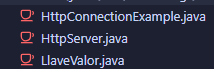
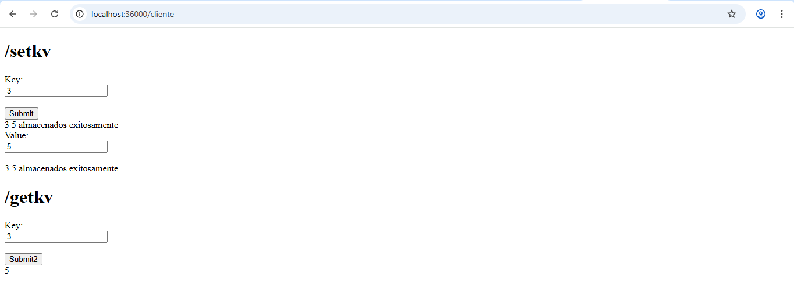

# AREP-Parcial1
Repositorio para el parcial 1 de AREP

## Descripción
Este parcial trata sobre un servidor que recibe solo peticiones GET de los clientes, hay 2 peticiones válidas /getkv y /setkv, la petición /setkv nos permite mandar una llave y un valor para que el back los guarde dentro de un HashMap internamente. Por otro lado /getkv nos permite recuperar el valor mandándole la llave.

## Como ejecutar

Se deben ejecutar las clases de HttpServer y LlaveValor mediante su método main al mismo tiempo ya que son máquinas distintas, la clase de HttpServer es quien recibe las peticiones y las redirige según la URL. Por otro lado la clase de LlaveValor tiene la lógica detrás de guardar y obtener los valores por llaves.

## Arquitectura
El servicio de backend consta de la clase LlaveValor

El servicio de fachada web es HttpServer

La fachada de servicios es HttpConnectionExample

## Evidencias de la funcionaidad
[Video](/Recording%202025-09-09%20111705.mp4)

Pruebas de la funcionalidad de ambas partes

Funcionalidad final retornando JSON para ambas respuestas

